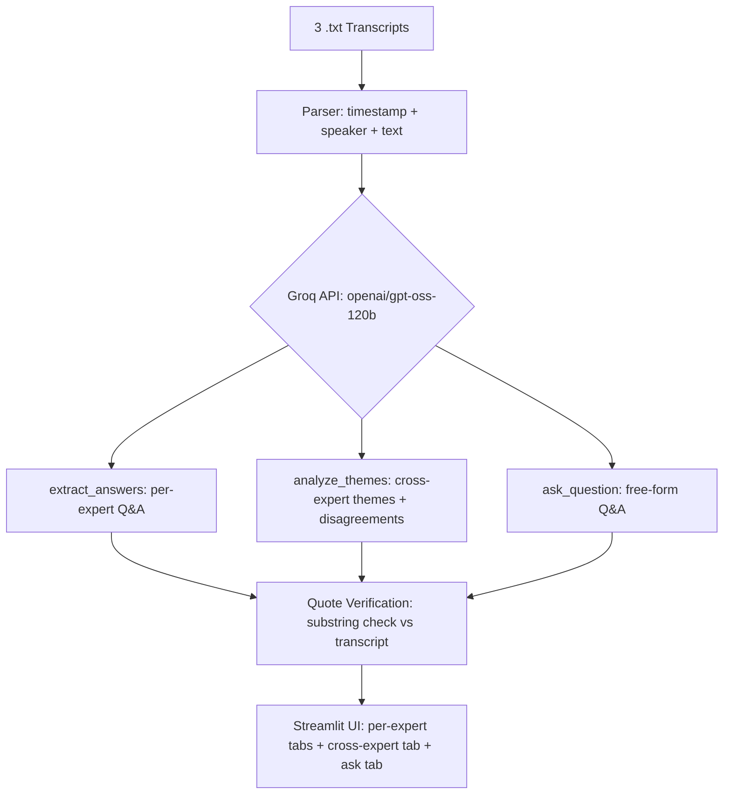

# Expert Call Transcript Analyzer

Streamlit app that reads 3 expert-call transcripts and answers interview-guide
questions per expert with cited quotes and timestamps, finds cross-expert
themes/disagreements, and answers free-form questions across all three.

## Architecture

No database or vector store — for 3 transcripts, the full transcript is sent straight to the model each time.

## Model choice

**Groq, `openai/gpt-oss-120b`** — free tier, no card needed. Despite the
`openai/` prefix it's an open-weight model hosted on Groq, not a call to
OpenAI's paid API. It's Groq's current recommended replacement for
`llama-3.3-70b-versatile`, which Groq deprecated on Aug 16, 2026.

Why: free, fast (Groq's LPU hardware), large enough context to fit a full
transcript in one call, and structured JSON output so answers don't need
regex parsing.

## Citations & timestamps

Transcripts are parsed into `{timestamp, speaker, text}` before anything is
sent to the model. The model is instructed to return the exact timestamp and
a verbatim quote for every answer, so each claim traces back to a specific
line in a specific transcript.

## Reducing hallucinations

- Strict prompt: only use what's in the transcript; say "Not found" if it isn't there
- Temperature 0
- Structured JSON output (fixed schema, less drift)
- Post-hoc check: every returned quote is verified as an exact substring of
  the source transcript before being shown as "verified"

## Scaling to 30+ transcripts

- Chunk + embed each transcript, store in a vector DB (Chroma/pgvector)
- Retrieve top-k relevant chunks per question instead of full-context stuffing
- Map-reduce for themes: summarize each transcript first, then compare summaries
- Same quote-verification step, just checked against the retrieved chunk

## Working app

Local: see below. Deployed link: **[add your Streamlit Cloud URL here]**

## Run locally

```bash
pip install -r requirements.txt
streamlit run app.py
```

Paste a free Groq key (console.groq.com/keys) into the sidebar, upload the 3
transcripts, click Analyze.